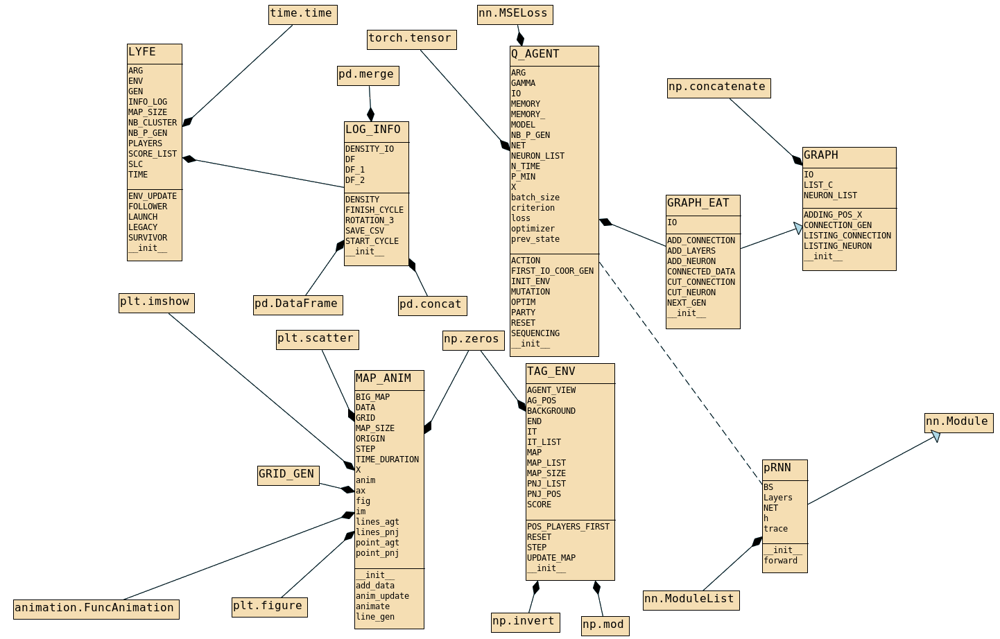

# Artificial neural networks Functionnalized by Evolution

###### Attribution required : Fabien Furfaro (CC 4.0 BY NC ND SA)

This is basis of project for the Article "An Artificial Neural Network Functionalized by Evolution" in [Arxiv](https://arxiv.org/abs/2205.10118).

Only testing code here, for the package see in **functionalfillet** folder. (in progress)

---

Tree structure :

* FUNC_TESTER.py (debugging)
* LYFE_MAIN.py
* * ANIM_LYFE.py
* * PLAY_IA.py
* * * TAG_ENV.py
* * * Q_AGENT_GEN.py
* * * * GRAPH_EAT.py
* * * * * GRAPH_GEN.py
* * * * pRNN_GEN.py

### UML

